# SysManager

A modern Windows system monitoring and management toolkit: live network
diagnostics with gamer-friendly presets, Windows updates, disk and memory
health, gaming launcher cache cleanup, app updates and bulk install via
winget, performance tuning, privacy and telemetry controls, context menu
management, secure file shredding, DNS & hosts editor, duplicate finder,
battery health, process management with built-in descriptions, startup
control, shortcut cleanup, app blocking, install alerts, Windows features
toggle, and a friendly Event Log viewer — all in one WPF desktop app.

[](https://github.com/laurentiu021/SystemManager/actions/workflows/ci.yml)
[](https://github.com/laurentiu021/SystemManager/actions/workflows/codeql.yml)
[](https://codecov.io/gh/laurentiu021/SystemManager)
[](https://github.com/laurentiu021/SystemManager/releases/latest)
[](https://github.com/laurentiu021/SystemManager/releases)
[](https://github.com/laurentiu021/SystemManager/issues)


[](https://github.com/laurentiu021/SystemManager/releases/latest)
[](LICENSE)
[](https://github.com/laurentiu021/SystemManager/stargazers)

---

### ⚡ Get it in one line

```powershell
winget install laurentiu021.SysManager
```

…or [**download the portable `.exe`**](https://github.com/laurentiu021/SystemManager/releases/latest) — self-contained, no installer, no .NET runtime needed. Runs on Windows 10/11.

> ⭐ **If SysManager saves you a reinstall or a head-scratch, please [star the repo](https://github.com/laurentiu021/SystemManager/stargazers)** — it's the single biggest help for a solo project and how others discover it.

---

## What it is

SysManager is a local-first desktop tool for keeping an eye on a Windows PC.
It rolls network diagnostics, system health, Windows Update, app management
(updates, bulk install, uninstall), privacy controls, context menu management,
secure file shredding, driver inventory, safe deep cleanup, and a readable
Event Log viewer into a single tabbed WPF app.

Everything runs on the machine itself. No cloud, no telemetry, no account.

Built with gamers in mind — live ping overlays for CS2, FACEIT, PUBG and streaming
endpoints, Steam/Epic/Battle.net/Riot/GOG/EA launcher cache cleanup, and
an honest "is it my PC, my ISP, or the server?" verdict.

## Why SysManager?

Most Windows utilities do one thing, or bundle telemetry and upsells. SysManager
is a single, local-first app that covers the whole maintenance surface — and it's
fully open source.

| | **SysManager** | CCleaner | Wintoys | O&O ShutUp10 | HWiNFO |
|---|:---:|:---:|:---:|:---:|:---:|
| Open source (MIT) | ✅ | ❌ | ❌ | ❌ | ❌ |
| No telemetry / no account | ✅ | ❌ | ❌ | ✅ | ✅ |
| Fully local (no cloud) | ✅ | ❌ | ✅ | ✅ | ✅ |
| Portable single `.exe` | ✅ | ❌ | ✅ | ✅ | ✅ |
| Disk / cache cleanup | ✅ | ✅ | ✅ | ❌ | ❌ |
| Privacy & telemetry toggles | ✅ | ⚠️ | ✅ | ✅ | ❌ |
| Network diagnostics (ping / traceroute / speed) | ✅ | ❌ | ❌ | ❌ | ❌ |
| Disk / RAM SMART health | ✅ | ⚠️ | ❌ | ❌ | ✅ |
| App updates + bulk install (winget) | ✅ | ❌ | ⚠️ | ❌ | ❌ |
| Free | ✅ | ⚠️ | ✅ | ✅ | ✅ |

<sub>⚠️ = partial, paywalled, or limited. Comparison reflects the free editions as of 2026; features evolve — corrections welcome via an issue.</sub>

## Features

### Sidebar navigation
The sidebar organises 57 feature tabs into 12 collapsible groups so you can
find what you need without scrolling through a flat list. 51 tabs are fully
implemented; 6 are work-in-progress placeholders marked with ⚙️:

| Group | Tabs |
|-------|------|
| 🏠 Dashboard | Dashboard |
| 🔧 System | System Health · Windows Update · Performance Mode · Services · Startup Manager · Windows Features · Restore Points · Task Scheduler · Boot Analyzer · System Fixes |
| 🎮 Gaming & Profiles | Gaming Profile ⚙️ · Standby List Cleaner · Timer Resolution · CPU Core Affinity · Display Profiles |
| 📊 Monitor | Process Manager · Resource History · Camera/Mic/Location · App Alerts · File Lock Detector · Settings Watchdog · Bandwidth Monitor ⚙️ |
| 🧹 Cleanup | Quick Cleanup · Deep Cleanup · Shortcut Cleaner · Scheduled Maintenance ⚙️ |
| 💾 Storage | Disk Analyzer · Duplicate Finder |
| 🌐 Network | Ping · Traceroute · Speed Test · Network Repair · DNS & Hosts |
| 📦 Apps | App Updates · Bulk Installer · Uninstaller |
| 🛡️ Privacy & Security | Privacy & Telemetry · File Shredder · App Blocker · Debloater & Ads · Browser Cleaner · Edge/OneDrive Remover ⚙️ · Defender Tweaks · Notification Blocker ⚙️ |
| 🎨 Customization | Context Menu · Dark Mode Scheduler · Volume Control ⚙️ |
| ℹ️ Info | Drivers · Battery Health · System Logs · System Report · Legacy Panels · About |
| ⚙️ Advanced | Profile Export/Import · CLI Interface · Environment Variables |

> ⚙️ = Work in Progress — placeholder tab visible in the sidebar, implementation coming in future updates.

Groups expand and collapse with a click. Collapsed groups show a child count
badge, a subtitle with abbreviated child labels, and a tooltip with the full
list. Dashboard renders as a flat top-level entry without an expander arrow.
Each tab shows a slim progress bar under its name when performing a
long-running operation, so you always know which tab is working.

### Theme customization
A palette button in the top-right corner opens an appearance popup with:
- **Dark mode** — 6 curated presets (Midnight Indigo, Deep Ocean, Dark Forest, Neon Rose, Violet Night, Warm Ember)
- **Light mode** — 6 curated presets (Clean Indigo, Sky Breeze, Warm Sand, Mint Fresh, Soft Blossom, Lavender)
- **Custom mode** — free hex input for accent, background, surface, and text colors
- Background shade slider for fine-tuning lightness/darkness
- Settings persist between sessions

### Context Menu Manager
Manage Windows Explorer right-click entries — toggle them on or off without
deleting anything (uses the standard `LegacyDisable` registry mechanism):
- **Presets:** Win10 Default (classic full menu), Win11 Default (modern compact), Custom
- Selecting a preset resets to clean defaults, disabling third-party entries — re-enable individually
- **Win10/Win11 style toggle** — switch between classic and modern menu (restarts Explorer)
- **Visual preview on hover** — real screenshots of each menu style
- **Entry explanations** — human-readable descriptions for common entries
- **"Applies to" column** — shows whether entry affects Files, Folders, Desktop, or Directory Background
- **HKCU fallback** — system-protected entries can be toggled via user-level registry override
- Admin elevation banner with one-click restart as administrator

### Environment Variables
Edit Windows environment variables without the cramped built-in dialog:
- **User and System scopes in one grid** — filter by scope, search by name or value
- **In-place value editing**, plus add and remove variables
- **Dedicated PATH editor** for PATH-like variables — reorder directories, remove
  entries, and strip duplicates in one click
- **Missing folders highlighted** so you can spot dead PATH entries at a glance
- **Local until Apply** — changes are staged; a one-time JSON backup of every
  variable is written before the first write so the original environment is recoverable
- Changes broadcast to Windows, so new terminals pick them up without a reboot
- System-scope edits need administrator rights (standard elevation banner); user
  variables can be edited without it

### Dark Mode Scheduler
- **Switch the Windows light/dark theme** instantly — apps only, or the taskbar
  and Start too
- **Schedule it** — set a dark time and a light time (e.g. 19:00 / 07:00) and the
  theme follows automatically; handles the overnight switch correctly
- Applies immediately with no sign-out, no admin needed, and is fully reversible
- **Honest about its limits** — the schedule runs while SysManager (or its tray)
  is open; it's not a background Windows service

### Network monitor
- Live ping across multiple targets overlaid on a single latency chart
- Auto-verdict that tells you in plain English whether packet loss is local,
  at your ISP, or at the far-end service
- **Presets for gamers & streamers**:
  - Global (Google, Cloudflare, your router)
  - **CS2 Europe** — Valve matchmaking relays (Vienna, Luxembourg, Warsaw, EU West/Central/East)
  - **FACEIT Europe** — competitive CS2 servers in DE, NL, UK
  - **PUBG Europe** — EU matchmaking cloud regions (Frankfurt, Ireland, London)
  - **Streaming** — YouTube, Twitch, Cloudflare
- Auto-traceroute on a configurable interval (30 s – 10 min)
- Speed tests: HTTP (Cloudflare) and the official Ookla CLI (auto-downloaded)
  with persistent history (last 20 results per engine) for tracking service
  degradation over time
- Jitter, loss %, and average ping per target rolled up into health pills
- **Network repair tools**: DNS flush, Winsock reset, TCP/IP reset with
  confirmation dialogs and admin checks

### System logs (Windows Event Log, friendly)
- Browse System, Application, Security, and Setup logs
- Each event gets a plain-English explanation and recommended next steps
- Filter by severity and time range, plus full-text search
- Export to CSV, with a "search online" link for unknown events

### System report
- One-click, read-only snapshot of the whole machine: OS, CPU, memory
  (with per-slot module detail), GPU, motherboard, storage health, and active
  network adapters
- Storage section carries SMART detail when available — temperature, wear %,
  and power-on time — reusing the same disk-health data as the System Health tab
- Export as **plain text**, a styled **self-contained HTML** page, or structured
  **JSON** — or copy the text straight to the clipboard
- Fully local: nothing on the system is changed and the report is written only
  to the file you choose — nothing leaves the machine

### System health
- OS / CPU / RAM / storage overview
- SMART data per disk: temperature, wear %, power-on hours, read/write errors
- Colour-coded verdict per drive
- Memory diagnostic that scans the last 30 days of WHEA events for RAM errors
- Schedule the Windows Memory Diagnostic at next boot
- Read-only chkdsk with auto-discovered NTFS/ReFS drives and multi-select
- **BIOS & firmware** — BIOS version/date/vendor, motherboard model, boot mode
  (UEFI/Legacy), and Secure Boot status, all read-only. A **Find BIOS update**
  button opens the right manufacturer support page (ASUS, MSI, Gigabyte, ASRock,
  Dell, HP, Lenovo, …) for the detected board, and **Copy info** grabs the model +
  BIOS version for support searches. SysManager never flashes firmware itself.

### Restore Points
- List every Windows System Restore point — sequence number, date, description,
  and type — newest first
- **Create** a restore point with an optional custom description (enables System
  Restore on the system drive first if it's off)
- **Restore** the PC to a selected point, with a clear confirmation that warns
  Windows will restart and that programs/drivers added since that point are removed
- Admin elevation banner — viewing the list works unprivileged; creating and
  restoring need administrator rights

### Legacy Panels
- One-click launcher for the classic Windows applets that newer releases keep
  hiding: Control Panel, Sound, Power Options, Network Connections, Region,
  System Properties, User Accounts, Device Manager, Computer Management,
  Programs and Features, Mouse, and Date and Time
- **Pure launchers** — each just opens the built-in panel; nothing is modified,
  so no elevation or confirmation is needed
- The applet list is fixed in code, so no typed input ever reaches the launcher

### System Fixes
One-click repairs for common Windows breakages, each with a clear description and
a confirmation before it runs:
- **Reset Windows Update** — stop the update services, clear the
  SoftwareDistribution and catroot2 caches, and restart the services
- **Reinstall WinGet** — re-register the App Installer when app installs/uninstalls fail
- **Set up Auto Sign-in** — opens the built-in User Accounts dialog, so Windows
  stores the credential securely and SysManager never handles your password
- Live output, honest success/failure reporting, admin elevation banner
- *Network-stack reset (Winsock / TCP-IP / DNS flush) lives on the Network → Network
  Repair tab, which offers those as individual one-click tools.*

### Boot Analyzer
- Shows how long your PC takes to boot — total, core (main path), and
  desktop ready-up time — across recent boots, read from the Windows
  boot-performance history (Diagnostics-Performance log)
- A trend line tells you whether the last boot was faster or slower than your
  recent average
- Lists the apps, drivers, services, and devices Windows flagged as slowing boot,
  with the delay attributed to each
- Read-only; reading the log requires administrator (elevation banner shown)

### Task Scheduler
- **Browse every Windows scheduled task** with its state, type, and last/next run
- **Color-coded by type** — Third-party, well-known **Telemetry** (Compatibility
  Appraiser, CEIP, Feedback, Error Reporting), and **System** — so it's obvious
  what's safe to touch
- **Enable / disable** any task; disabling is **fully reversible and never deletes
  the task** — System tasks show an extra warning before you disable them
- Filter by name or path, and optionally hide system tasks to focus on the rest
- Changes need administrator and are verified by reading the task's state back

### Windows Update (Windows Update Agent COM API)
- Direct Windows Update Agent COM integration (`Microsoft.Update.Session`) —
  installs everything WUA can offer, including optional drivers and firmware
  that PSWindowsUpdate filters out client-side
- Unified DataGrid for **everything** in one scan — standard, feature
  upgrades, optional drivers, and hidden updates
- Categorized with colored pills: Security, Cumulative, Defender, Driver,
  Servicing, .NET, Feature upgrade, Hidden — click headers to sort
- Per-update checkbox selection with Select all / Deselect all — install
  exactly what you want, skip what you don't
- Live progress per update: `Connecting → Downloading → Installing → ✓ Installed`
  streamed to the console as it happens
- Per-row Status column updated in real time
  (`Pending…` → `Downloading…` → `Installing…` → `Installed` /
  `Installed (reboot required)` / `Failed` / `Not applied`)
- Honest aggregate reporting:
  `Installed X/Y. Failed: Z. Not applied: W.`
- Reboot detection — toast notification if any update requires reboot
- Pending-reboot check, update history (last 30 — via PSWindowsUpdate)
- Admin banner with a one-click "Run as Administrator" relaunch
- PSWindowsUpdate is optional now (used only for the History view)
- **Update timing & deferral** — defer feature updates by N days while security
  patches keep flowing, pause all updates for a bounded window (max 35 days, then
  Windows auto-resumes), or restore defaults. Uses the documented Windows Update
  policy keys and is fully reversible. No "disable updates forever" option by
  design — the strongest action is a bounded pause, so the machine is never left
  permanently unpatched.

### App updates (winget)
- Scan for upgradable packages
- Sort by name, ID, version, or source via clickable column headers
- Select all or individual packages, bulk upgrade with per-package status

### Cleanup (fast)
- Clear TEMP folders
- Empty the Recycle Bin
- Run `SFC /scannow` and `DISM /RestoreHealth` in the background — keep
  using the app while they grind

### Deep cleanup (safe)
- **Scan-first**: every category is discovered with size + file count
  before a single byte is deleted. You pick what goes.
- **System buckets**: NVIDIA / AMD / Intel installer leftovers, Windows
  Update cache, Delivery Optimization cache, Windows Installer patch
  cache, TEMP, Prefetch, crash dumps, old CBS logs, DirectX shader cache,
  Recycle Bin on every drive.
- **Gamer buckets** — launcher *caches only*, never game files or logins:
  Steam (appcache, htmlcache, depotcache, shader cache), Epic Games
  Launcher, Battle.net, Riot / League of Legends, GOG Galaxy, EA Desktop.
- **Windows.old** is detected and flagged as irreversible, never selected
  by default.
- Safe by design: never touches browsers, passwords, the registry, active
  drivers, or actual game files. Locked files are skipped, never forced.

#### Large files finder (part of Deep Cleanup)
- Scan Downloads, Documents, Desktop, Videos, Pictures, Music, Program
  Files, or a whole drive.
- Configurable min-size (default 500 MB) and top-N (default 100).
- **Read-only** — only "Show in Explorer" and "Copy path" actions. Deletion
  is disabled by design so a mis-click can never hurt anything.

### Startup Manager
- Lists every program that runs at Windows boot (Registry Run / RunOnce keys)
- Toggle on/off without deleting the original entry (same mechanism as Task Manager)
- Sort by name, publisher, or status via clickable column headers
- Shows name, publisher, command, and enabled/disabled status
- Open file location in Explorer

### Windows Features
- Lists all Windows optional features with current state (Enabled/Disabled)
- Toggle enable/disable per feature with confirmation dialog
- Categorized: Virtualization, Networking, Development, Media & Print, Legacy
- Shows reboot-required status after toggling
- Search/filter across all features
- Requires administrator privileges for modifications

### Duplicate File Finder
- Three-pass scan: group by size, partial-hash pre-filter, then full SHA-256
- Duplicate groups sorted by wasted space (descending)
- Preset folders or custom folder selection
- Configurable minimum file size filter
- **Read-only** — "Show in Explorer" and "Copy path" only, no delete

### Disk Analyzer
- Space breakdown by top-level folders with drill-down navigation
- Drive usage bar with total/used/free
- Preset paths (fixed drives, user profile, Program Files) or custom browse
- Show in Explorer for each folder
- Skips system paths automatically

### Process Manager
- Lists running Windows processes with PID, memory, threads, and status
- Real-time filter by name, description, category, or PID
- Sort by memory, CPU usage, name, or PID via clickable column headers
- **Built-in description database** — 108 common Windows processes and popular
  applications with plain-language descriptions, categories (System, Browser,
  Development, Communication, Media, Gaming, etc.), and safety indicators
  (System, Trusted, Unknown)
- Kill process with confirmation dialog
- Open file location in Explorer

### Resource History
- **Historical CPU, RAM, GPU usage and temperatures** — the app samples your
  vitals every 10 seconds in the background (including while minimized to the
  tray), so you can investigate what caused a spike yesterday instead of seeing
  only the live moment
- **Scrollable timeline** — pick a range (last hour, 6 hours, 24 hours, 7 days,
  30 days); the usage chart (CPU / RAM / GPU %) and a separate temperature chart
  (CPU / GPU °C) redraw to fit, downsampled so even a 30-day view stays smooth
- **Configurable retention** — keep 7, 14, or 30 days of history; older samples
  are pruned automatically
- **Export to CSV** — save the visible range for analysis in Excel or elsewhere
- Strictly local: history is stored in your `%LocalAppData%\SysManager` folder
  and nothing ever leaves the machine

### File Lock Detector
- **Find what's holding a file** — when you get a "file in use" error, enter or
  browse to a file/folder path and see which process(es) are using it, via the
  Windows Restart Manager (the same mechanism Explorer's own dialog uses)
- Shows process name, PID, type, and start time for each locker
- **End process** — terminate a selected locker (with confirmation) to release
  the file; critical system processes are protected from termination
- Detection works as a standard user; ending a process owned by SYSTEM or
  another user needs administrator rights (surfaced, not crashed)

### Camera/Mic/Location
- Shows which apps recently used your **camera, microphone, or location**, and when
- Reads the Windows access history (CapabilityAccessManager consent store) — covers
  both Store apps and desktop programs
- Devices **in use right now** are flagged and sorted to the top
- Read-only: an **Open privacy settings** button hands off to Windows to grant or
  revoke a permission — SysManager never changes capability permissions itself

### Settings Watchdog
- **Catch the settings Windows Update silently resets** — feature and quality
  updates often flip telemetry back to Full, re-enable web search, the Widgets
  board, lock-screen ads, and Start-menu suggestions
- **Save a baseline** of your current preferences with one click; the watchdog
  remembers exactly what each watched setting was
- **Check now** re-reads the live values and lists any drift in plain language —
  e.g. *"Diagnostic data: was 'Off (Security)', now 'Full'"* — with the category
  and a before/after comparison
- **Restore changed** writes the drifted settings back to your baseline values in
  one step (HKLM-backed settings need administrator rights, surfaced not crashed)
- Strictly local: the baseline lives in your `%LocalAppData%\SysManager` folder and
  the watchdog only ever reads or writes a fixed list of well-known registry values

### Operation Lock
- Prevents conflicting concurrent operations across tabs
- Operations grouped by category (Disk, Network, SystemModification)
- If a conflicting operation is already running, the UI shows which operation
  is blocking and refuses to start the new one
- Integrated into: Dashboard, Deep Cleanup, Disk Analyzer, Duplicate Finder,
  Quick Cleanup, Speed Test, Traceroute, Network Repair, Shortcut Cleaner

### Shortcut Cleaner
- Scans Desktop, Start Menu, Quick Launch, and Recent Items for broken .lnk
  shortcuts whose targets no longer exist
- Lists results with name, location, and missing target path
- Select all / deselect individual items
- Move to Recycle Bin or permanent delete, with confirmation dialog
- COM-based IShellLink resolution for accurate target validation

### Privacy & Telemetry
- 12 registry-based toggles across 3 categories (Telemetry, UI Declutter, Features)
- **Telemetry**: disable diagnostic data, activity history, advertising ID, feedback prompts
- **UI Declutter**: disable Start suggestions, tips, lock screen tips, Spotlight ads
- **Features**: disable Copilot, Cortana, web search in Start, widgets
- Explicit apply — flip toggles to stage changes, press **Apply** to write to the
  registry, or **Discard** to revert pending changes. A live counter shows how
  many changes are queued, so accidental clicks never modify the system silently.
- Category filter and search
- Requires admin for HKLM-backed toggles
- Fully reversible — re-enable any toggle with one click

### File Shredder
- Secure multi-pass file and folder deletion beyond recovery
- Three shred methods: Quick (1 pass, zero fill), Standard (3 passes), Thorough (7 passes)
- Cryptographically random overwrite data (RandomNumberGenerator)
- Add files or entire folders via file picker dialogs
- Progress tracking per-item with cancel support
- Skips junction points and symbolic links (prevents symlink attacks)
- Confirmation dialog before irreversible shred

### DNS & Hosts
- **DNS Preset Switching** — one-click DNS change: plain resolvers (Google,
  Cloudflare, Quad9, OpenDNS) plus **ad/malware/family-blocking variants**
  (Cloudflare 1.1.1.2 malware / 1.1.1.3 family, AdGuard DNS ad-blocking + family,
  OpenDNS FamilyShield), each with a description of what it blocks. **IPv6
  resolvers** are configured automatically alongside IPv4. Reset to automatic
  (DHCP) any time; shows current active DNS. An **Undo** button restores the exact
  DNS configuration in effect before the last change.
- **Hosts File Editor** — view, add, and remove entries from the Windows
  hosts file with a clean table UI. Add IP + hostname pairs, toggle entries,
  or remove them. Backs up hosts file before modifications.
- Requires administrator privileges for both DNS and hosts operations
- Admin elevation banner with one-click restart

### Bulk Installer
- Curated catalog of popular applications grouped by category: Browsers,
  Communication, Media, Development, Utilities, Gaming, Security,
  Office & Productivity, Creativity, Networking & VPN, Runtimes & Frameworks
- Select multiple apps and install all via winget in one batch operation
- **Custom winget search** — search the entire winget repository and add
  any package to your install queue
- Category filter and text search across the catalog
- Per-package install status tracking with ETA
- Live console output showing winget progress
- GroupedView with visual category headers

### App Alerts
- Monitors Program Files, AppData\Programs, and registry uninstall keys for
  new application installations
- FileSystemWatcher on install directories + 30-second registry poll cycle
- Shows timestamped install history with app name, publisher, path, and
  detection source
- Start/stop monitoring, acknowledge alerts, show all currently installed
  apps, clear history

### App Blocker
- Blocks applications from executing using Image File Execution Options (IFEO)
  registry mechanism
- Enter an exe name or browse for a file, confirm, and the app is prevented
  from launching
- Fully reversible — unblock restores normal execution
- Shows list of currently blocked apps with select/deselect and batch unblock
- Requires admin privileges for registry modifications

### Debloater & Ads
Remove preinstalled Windows Store apps you don't use:
- **Scan** all installed Store apps with name, publisher, and a short description
- **Curated "common bloat" preset** pre-selects safe, frequently-removed apps
  (Bing News/Weather, Clipchamp, Solitaire, Xbox apps, consumer Teams, and more)
- **System-critical apps are protected** — the Store, frameworks, and security/shell
  components are denylisted and can never be selected or removed
- **Impact summary + confirmation** before anything is uninstalled
- **Reversible** — removal is per-user, so any app can be reinstalled from the Store
- Search and per-app descriptions help you decide before removing

### Browser Cleaner
Reclaim space and clear browsing traces, per browser:
- **Auto-detects** Chrome, Edge, Brave, Opera, and Firefox
- **Per-category** with size shown: Cache, History, Cookies, Sessions
- **Cookies/sessions are flagged and left unticked** by default — cleaning them
  signs you out, so it's always an explicit choice; cache and history are pre-selected
- **Confirmation with an impact summary** before anything is deleted
- Per-user (no admin); locked files (browser open) are skipped, not forced, and
  symlinks/junctions are never followed

### Defender Tweaks
Manage Microsoft Defender without digging through Windows Security:
- **Status at a glance** — real-time protection, cloud protection (MAPS), PUA
  protection, and Controlled Folder Access
- **Toggle PUA protection and Controlled Folder Access** (ransomware protection)
- **Scan exclusions** — add or remove folders Defender should skip (handy for
  big game libraries); paths are validated and additions never replace your
  existing exclusions
- **Honest about Tamper Protection** — if it's on, Windows can silently ignore
  changes, so the tab detects it, warns you, and only reports a change as done
  after reading it back and confirming Windows actually applied it
- Changes need administrator and are confirmed first; lowering a protection is
  always an explicit, reversible choice

### Battery Health
- Charge %, health %, wear level, cycle count, chemistry
- Design vs full-charge capacity via WMI
- Estimated runtime display
- Gracefully shows "No battery detected" on desktops

### Uninstaller
- Lists all installed applications via winget with size from registry
- Filter by name or package ID
- Sort by name, size, or publisher via clickable column headers
- Select/deselect all, batch uninstall with confirmation dialog
- Local app support — uninstalls apps not in winget via registry UninstallString
- Live console output from winget

### Timer Resolution
- **Lower input latency for games** — requests the finest Windows timer
  resolution (≈0.5 ms) instead of the ~15.6 ms default, via the ntdll
  `NtSetTimerResolution` API
- **Live current/finest/default readout** — always re-queries the *effective*
  resolution (Windows 11 may stop honoring a request while the window is
  minimized), so the number shown is the real one
- **One-click enable / restore** — fully reversible; the request is released
  when you restore it or simply close the app. No admin required
- **Power-cost warning** — a finer timer wakes the CPU more often, increasing
  power draw and battery drain on laptops

### Display Profiles
- **Quick-switch resolution + refresh rate** — pick a mode (e.g. 165 Hz for
  gaming, 60 Hz for work) from the list of everything your display supports,
  using only the Windows display APIs (no NVIDIA/AMD tool conflict)
- **Safe by design** — applies for the session, so a reboot reverts; on top of
  that a **15-second auto-revert** restores the previous mode unless you confirm
  "Keep", so a bad mode can never strand you on a blank screen
- **Per-display** — choose which monitor to configure; shows the current mode
- Validates each mode (CDS_TEST) before applying; no admin required

### CPU Core Affinity
- **Pin a process to specific CPU cores** — pick a running process and choose
  which logical CPUs it may run on, then Apply (or Restore the original)
- **Hybrid-CPU aware** — on Intel 12th-gen+ CPUs, P-cores and E-cores are
  detected and labelled (via `GetLogicalProcessorInformationEx`), with one-click
  **P-cores** / **All cores** presets
- **Safe and temporary** — affinity is per-running-process and reverts when the
  process exits; no admin for your own processes (changing another user's
  process is surfaced as needing admin, not a crash)
- An empty selection is rejected — Windows treats an empty mask as "let the OS
  decide", so the app never silently does the opposite of what you picked

### Standby List Cleaner
- **Frees cached standby memory** — the built-in equivalent of ISLC, to reduce
  stutter when RAM runs low in games
- **Live stats** — total RAM, available, and memory load %, refreshed every 2s
- **Purge on demand** or **auto-purge** when available RAM drops below a
  threshold you set with a slider
- **Safe and non-destructive** — the standby list is clean, disk-backed file
  cache, so clearing it loses nothing; Windows reloads from disk on next use
- Reading stats needs no admin; purging requires administrator (it enables the
  same privilege RAMMap and ISLC use) and reports cleanly if not elevated

### Performance Mode
- **Per-tweak Apply buttons** — each setting is independent
- **Power Plan**: Balanced / High Performance / Ultimate Performance
- **Visual Effects**: reduce animations via P/Invoke (instant, no logout)
- **Game Mode**: enable/disable via registry
- **Xbox Game Bar**: disable overlay and Game DVR via registry
- **NVIDIA GPU**: force max performance with auto-detected GPU subkey (reboot required)
- **Processor State**: force CPU min state to 100%
- **Overlays info**: manual instructions for Discord, Steam, NVIDIA GFE, EA App
- **OriginalSnapshot**: captures exact system state before first change;
  Restore All reverts to the snapshot, not hardcoded defaults
- Confirmation dialog before every change
- **Restore point creation**: create a Windows System Restore point before
  making changes (requires admin)
- **RAM working set trim**: free physical RAM by trimming all process working
  sets — same as RAMMap's "Empty Working Set" (useful before launching a game)
- **Hibernation toggle**: enable/disable hibernation to free disk space
  (deletes hiberfil.sys when disabled)

### Services
- Lists all Windows services with current status and startup type
- **Gaming recommendations**: services tagged as "safe to disable", "advanced",
  or "keep enabled" with per-service explanations
- Filter by status (Running/Stopped), recommendation level, or free-text search
- Start, stop, disable, or enable services with confirmation dialogs
- Requires admin for all mutations

### Drivers
- Sortable DataGrid table of all installed system drivers
- Columns: Device Name, Manufacturer, Version, Date — click headers to sort
- Data parsed from `Get-CimInstance Win32_PnPSignedDriver`

### Dashboard
- One-line OS / CPU / RAM / disk summary
- Live uptime counter
- **Real-time vitals** — CPU, RAM, and GPU usage refreshed at 300 ms while
  the tab is visible (polling pauses automatically when it isn't), with live
  indicator dots.
- **Recent Activity** — the last features you opened and actions you ran
  (cleanups, DNS changes, app removals, restore points, …) with timestamps.
- **Quick Tune-Up** — one-click wizard that cleans temp files, optionally
  empties the Recycle Bin, scans for broken shortcuts, checks disk SMART
  health, flags high uptime (14+ days) and high RAM usage (85%+). Displays
  a summary card with freed space, warnings, and links to relevant tabs.
  Non-destructive, no admin required.
- **Health Score** — overall system health gauge (0–100) combining disk
  SMART, RAM usage, uptime, and battery wear. Color-coded ring (green /
  amber / red) with up to 3 actionable recommendations. Auto-computes on
  load and refreshes with "Scan system".
- **System Tray** — minimize-to-tray on close, background health monitoring
  (60s polling), CPU/RAM tooltip, Windows notifications when RAM > 90%,
  uptime > 14 days, or disk health degrades. Context menu: Show / Exit.

### Updates (for SysManager itself)
- Auto-check on startup against the GitHub Releases API, plus a manual
  "Check for updates" button in the About tab.
- Discreet banner in the main window when a newer version is available.
- Background download of the new build with a progress bar. If the
  download is blocked, a "Manual download" button opens GitHub in the
  browser.
- SHA256 hash + Authenticode signature verification before install — blocks
  corrupted or tampered downloads.
- One-click "Install" replaces the running executable in-place and
  restarts automatically (no manual file copying needed).
- Full release-note history pulled live from GitHub.

### Profile Export / Import
- Export your SysManager settings — theme/appearance and speed-test history — to
  a single portable JSON file, and import them on another PC
- **Selective export** (tick which sections to include) and **selective import**
  (confirm what a profile contains before anything is overwritten)
- **Version-aware** — refuses profiles created by a newer, incompatible build
- Only SysManager's own config is ever touched (never system settings), so an
  import is fully reversible — just import a different profile

### CLI Interface
- **Automate the safe actions from scripts, Task Scheduler, or deployment tools** —
  SysManager accepts command-line flags and runs headless (no window), writing its
  output to the launching console
- Commands: `--health` (read-only health score), `--cleanup` (temp-file cleanup,
  never follows junctions), `--trim-ram` (purge the standby list), plus `--version`,
  `--help`, and `--list`
- `--json` emits machine-readable output; `--silent` suppresses chatter for
  scripting; conventional **exit codes** (0 success · 1 error · 2 usage) let a script
  branch on the result
- Only read-only or non-destructive actions are exposed on the CLI — anything that
  changes the system irreversibly stays in the GUI behind a confirmation dialog
- The in-app **CLI Interface** tab is a reference: it lists every command with a
  one-click copy button. Example: `SysManager.exe --cleanup --silent`

## Screenshots

> Click any thumbnail to view full size. Screenshots live under
> [`docs/screenshots/`](docs/screenshots/) — see
> [`docs/screenshots/README.md`](docs/screenshots/README.md) for capture
> conventions.

<details open>
<summary><strong>🏠 Dashboard</strong></summary>
<br>
<a href="docs/screenshots/01-dashboard.png">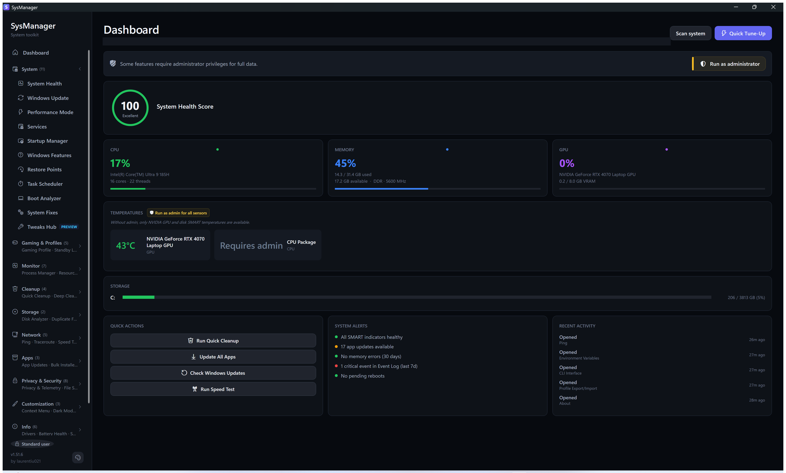</a>
</details>

<details>
<summary><strong>🔧 System</strong> — Health · Windows Update · Performance</summary>
<br>
<p>
<a href="docs/screenshots/02-system-health.png">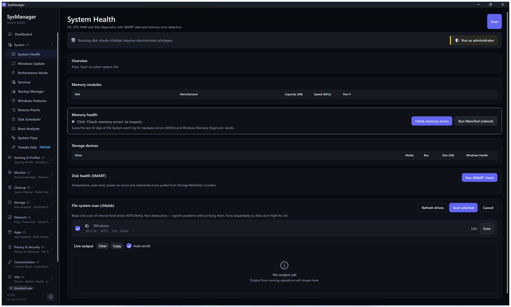</a>&nbsp;
<a href="docs/screenshots/03-windows-update.png">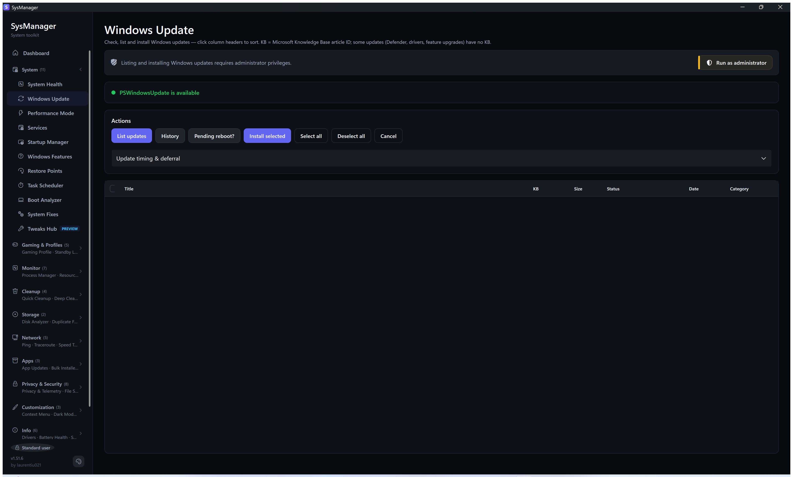</a>&nbsp;
<a href="docs/screenshots/04-performance.png">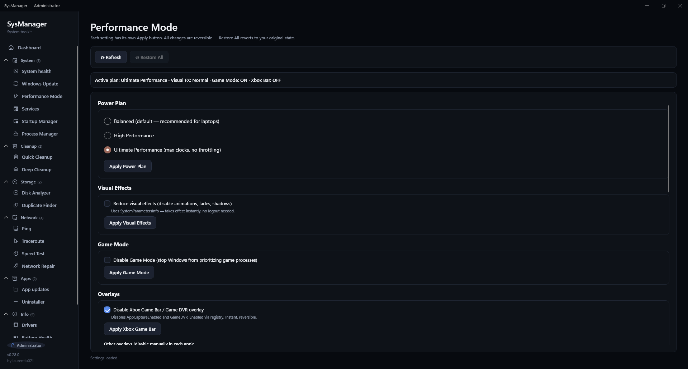</a>
</p>
</details>

<details>
<summary><strong>🧹 Cleanup</strong> — Quick Cleanup · Deep Cleanup</summary>
<br>
<p>
<a href="docs/screenshots/05-quick-cleanup.png">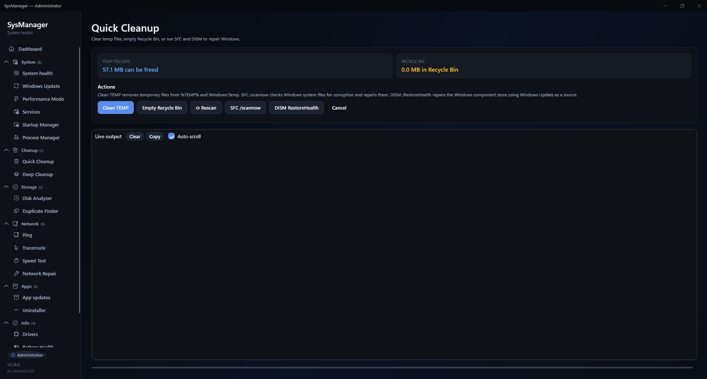</a>&nbsp;
<a href="docs/screenshots/06-deep-cleanup.png">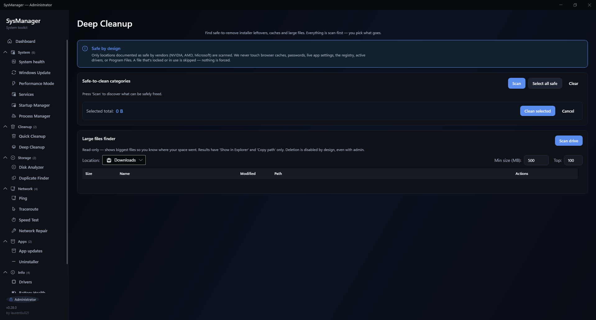</a>
</p>
</details>

<details>
<summary><strong>💾 Storage</strong> — Disk Analyzer · Duplicates</summary>
<br>
<p>
<a href="docs/screenshots/07-disk-analyzer.png">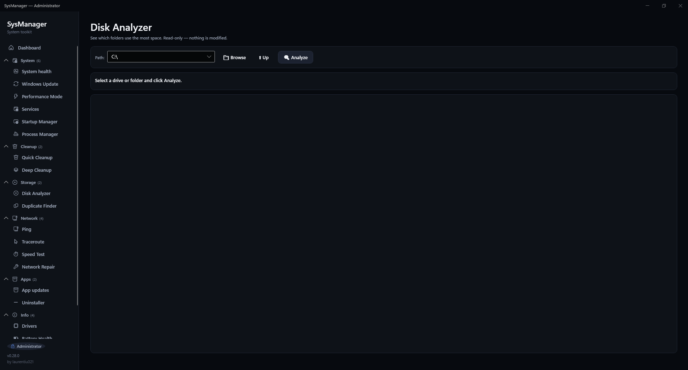</a>&nbsp;
<a href="docs/screenshots/08-duplicates.png">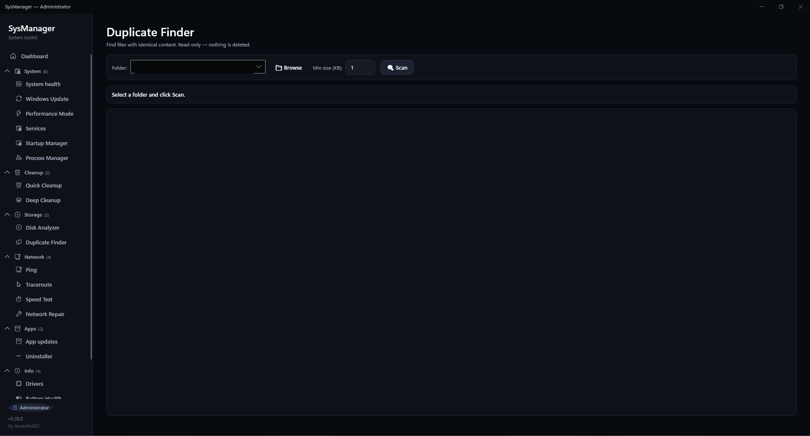</a>
</p>
</details>

<details>
<summary><strong>🌐 Network</strong> — Ping · Traceroute · Speed Test · Repair</summary>
<br>
<p>
<a href="docs/screenshots/09-ping.png">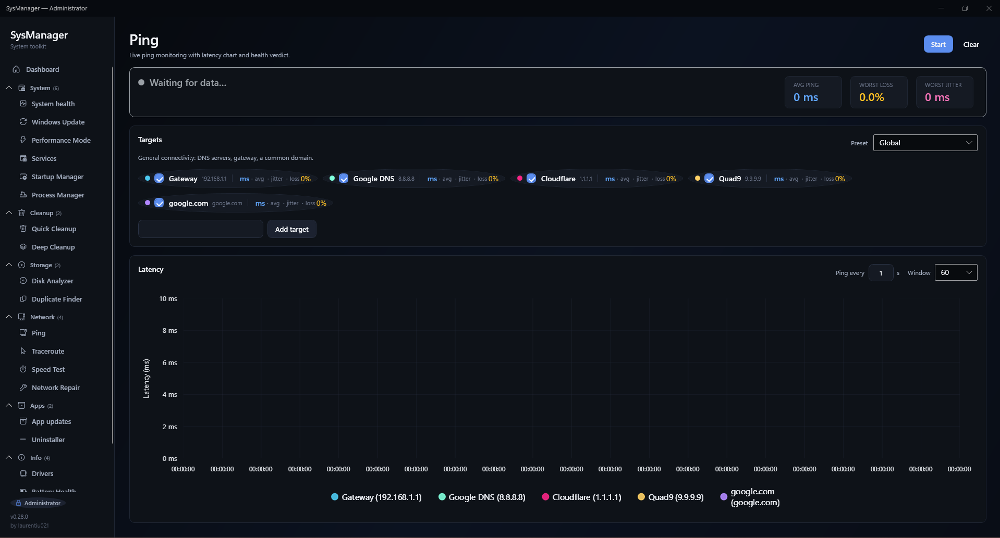</a>&nbsp;
<a href="docs/screenshots/10-traceroute.png">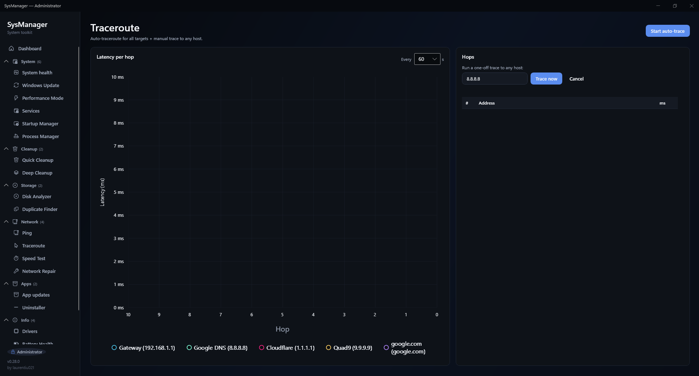</a>
</p>
<p>
<a href="docs/screenshots/11-speed-test.png">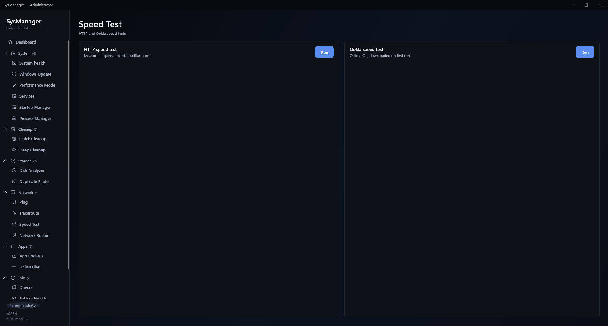</a>&nbsp;
<a href="docs/screenshots/12-network-repair.png">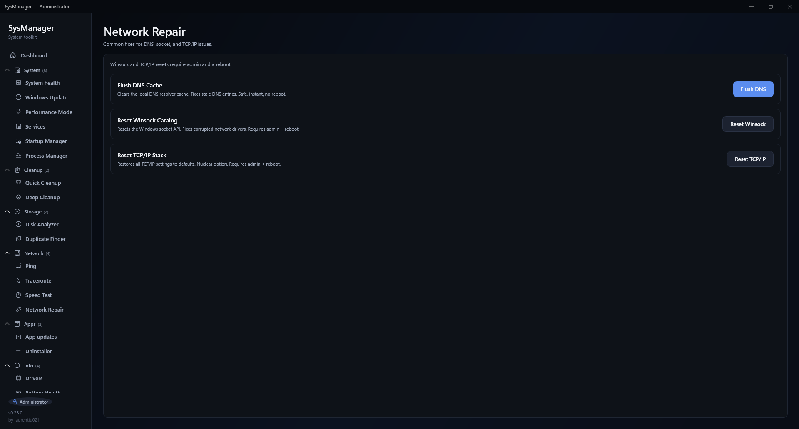</a>
</p>
</details>

<details>
<summary><strong>📦 Apps</strong> — App Updates · Uninstaller</summary>
<br>
<p>
<a href="docs/screenshots/13-app-updates.png">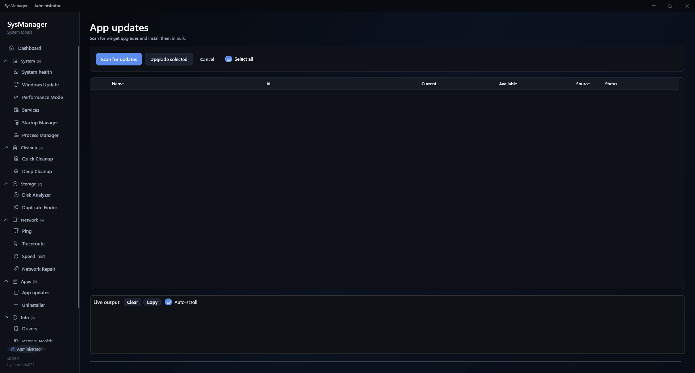</a>&nbsp;
<a href="docs/screenshots/14-uninstaller.png">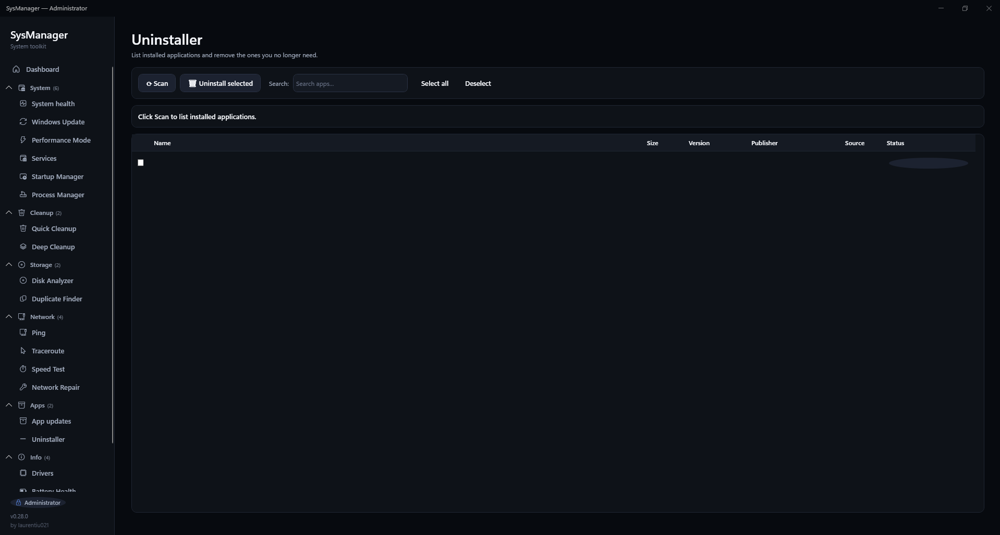</a>
</p>
</details>

<details>
<summary><strong>ℹ️ Info</strong> — Drivers · Battery · Logs · About</summary>
<br>
<p>
<a href="docs/screenshots/15-drivers.png">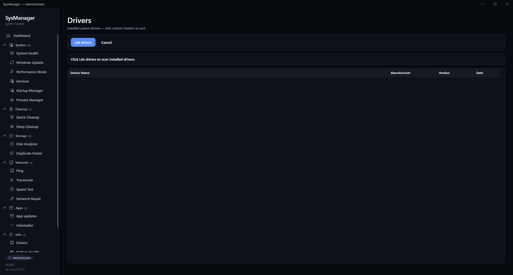</a>&nbsp;
<a href="docs/screenshots/16-battery.png">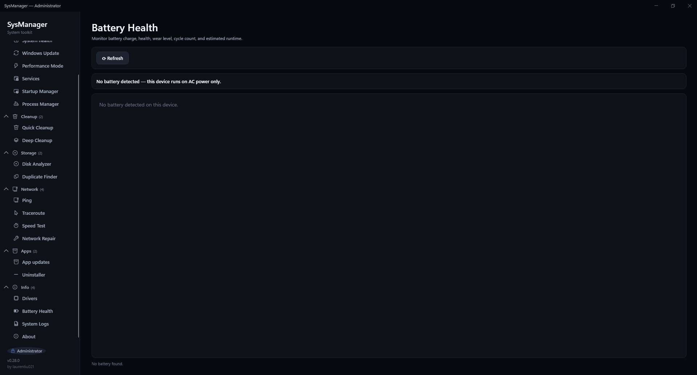</a>
</p>
<p>
<a href="docs/screenshots/17-logs.png">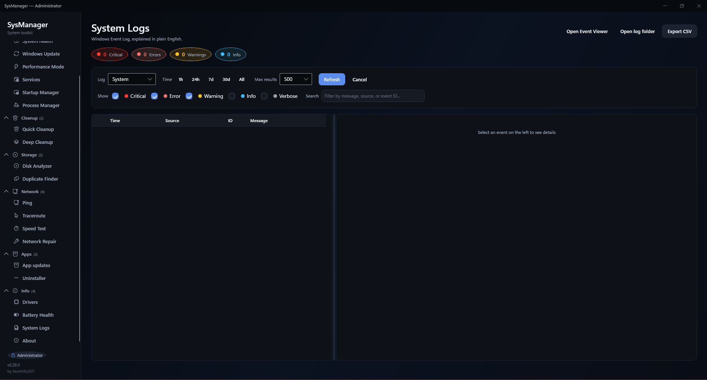</a>&nbsp;
<a href="docs/screenshots/18-about.png">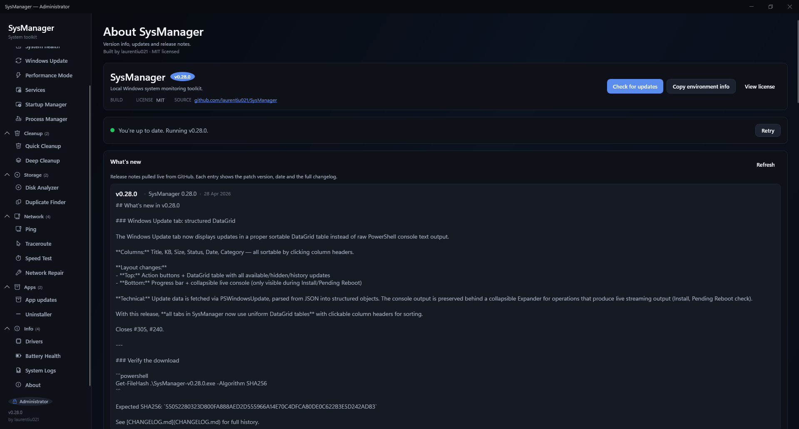</a>
</p>
</details>

## Install

### Via winget (recommended)

SysManager is published to the [Windows Package Manager](https://learn.microsoft.com/windows/package-manager/)
community repository. Install or update with a single command:

```powershell
winget install laurentiu021.SysManager
```

Updates are delivered automatically with each release — run `winget upgrade`
to stay on the latest version.

### Direct download

Grab `SysManager-v<version>.exe` (the `<version>` shown on the latest release) from the
[latest release](https://github.com/laurentiu021/SystemManager/releases/latest)
and double-click it. The executable is self-contained — no installer, no .NET
runtime required.

### Verifying the download

Each release ships a matching `SysManager-v<version>.exe.sha256`. Verify before running
(replace `<version>` with the version you downloaded):

```powershell
Get-FileHash .\SysManager-v<version>.exe -Algorithm SHA256
# Compare the output to the contents of SysManager-v<version>.exe.sha256.
```

The build is not currently code-signed, so Windows SmartScreen may warn on
first launch. Verifying the SHA256 matches the one on the release page is the
recommended mitigation — see [SECURITY.md](SECURITY.md) for details.

## Build from source

Prerequisites: Windows 10 or newer and the [.NET 10 SDK](https://dotnet.microsoft.com/download/dotnet/10.0).

```powershell
git clone https://github.com/laurentiu021/SystemManager.git
cd SystemManager
dotnet run --project SysManager/SysManager/SysManager.csproj
```

### Produce a single-file exe

From the repo root:

```powershell
.\publish.ps1
```

Or manually:

```powershell
dotnet publish SysManager/SysManager/SysManager.csproj `
  -c Release -r win-x64 --self-contained true `
  -p:PublishSingleFile=true -p:IncludeNativeLibrariesForSelfExtract=true `
  -o publish
```

The resulting `SysManager.exe` lands in `publish/` and runs standalone on any
Windows 10 / 11 x64 machine.

## First-time flow

1. Launch the app — it opens on the Dashboard.
2. Go to Network and press Start — live ping begins.
3. For anything in Windows Update, Cleanup (SFC/DISM), or system-wide App
   updates, click the yellow "Run as Administrator" banner when it appears.
   The app relaunches elevated.

## Documentation

- [ARCHITECTURE.md](ARCHITECTURE.md) — project structure and key design decisions
- [TESTING.md](TESTING.md) — how the test suite is organised and run
- [CHANGELOG.md](CHANGELOG.md) — release notes
- [CONTRIBUTING.md](CONTRIBUTING.md) — how to build, test, and open a PR
- [SUPPORT.md](SUPPORT.md) — where to ask questions and get help
- [SECURITY.md](SECURITY.md) — reporting vulnerabilities, security model
- [CODE_OF_CONDUCT.md](CODE_OF_CONDUCT.md) — community standards

## Reporting bugs and requesting features

Found something broken? Missing a feature you'd love to have?

- 🐛 **Bugs** — [open an issue](https://github.com/laurentiu021/SystemManager/issues/new?template=bug_report.yml)
  using the bug report template.
- 💡 **Features** — [open an issue](https://github.com/laurentiu021/SystemManager/issues/new?template=feature_request.yml)
  using the feature request template.
- 💬 **Questions and how-to's** — use
  [Discussions](https://github.com/laurentiu021/SystemManager/discussions) instead
  of issues for anything open-ended.
- 🔒 **Security vulnerabilities** — please report privately via the
  [Security tab](https://github.com/laurentiu021/SystemManager/security/advisories/new).
  See [SECURITY.md](SECURITY.md) for the full policy.

The **About** tab inside the app has a "Copy environment info" helper that
dumps your SysManager version, Windows build, CPU, RAM, GPU, storage, display,
and elevation state in a format ready to paste into a bug report.

## Tech stack

- .NET 10 (WPF, C# 14)
- CommunityToolkit.Mvvm for MVVM plumbing
- Microsoft.Extensions.DependencyInjection for IoC
- WPF-UI (lepoco/wpfui) for Fluent Design theme and controls
- LiveCharts2 for the real-time latency chart
- H.NotifyIcon.Wpf for system tray integration
- LibreHardwareMonitor and NvAPIWrapper for CPU/GPU/disk temperature sensors
- Serilog for structured logging
- xUnit, NSubstitute, and FlaUI for unit, integration, and UI-automation tests

## Privacy

SysManager runs entirely on your machine. It does not phone home, does not
collect telemetry, and does not require an account. Network features only
contact the hosts you explicitly configure (ping targets, speed-test servers,
Windows Update / winget endpoints).

## Contributing

PRs welcome! Please read [CONTRIBUTING.md](CONTRIBUTING.md) for the build
setup, coding conventions, and pull-request workflow. New contributors are
expected to follow the [Code of Conduct](CODE_OF_CONDUCT.md).

## Support

SysManager is free and open source, built by one person in their spare time.
If it saved you a reinstall or a clean-up headache, you can back its development:

[](https://github.com/sponsors/laurentiu021)

Sponsorships go toward a code-signing certificate, so Windows stops warning on
first launch, plus the build pipeline and time to fix bugs and finish the tools
that are still half-built. The app stays free either way.

## License

MIT — see [LICENSE](LICENSE).

Crafted by [laurentiu021](https://github.com/laurentiu021).
